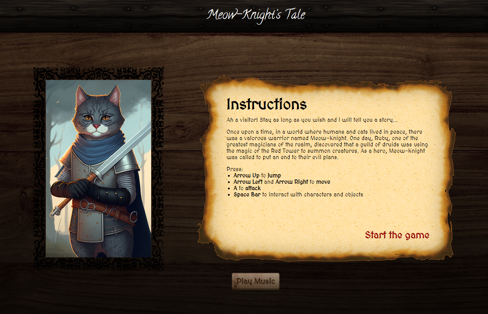

# Meow-Knight's Tale

## Table of contents
* [Description](#description)
    - [Introduction](#introduction)
    - [How To Play](#how-to-play)
* [Technologies](#technologies)
* [Features](#features)
* [Demo](#demo)
* [Next Steps](#next-steps)

## Description

### Introduction
Meow-Knight's Tale is a simple Action RPG game where the user has to play a cat-knight in a medieval setting.
The purpose of the game is to go to level 3 and interact with the Red Tower, after defeating as many enemies as possible.

### How To Play

* **Arrow Up** to **Jump**.
* **Arrow Left** and **Arrow Right** to **move**.
* **A** to **Attack**.
* **Space Bar** to interact with characters and objects.

## Technologies
The game was created using:
* HTML
* CSS
* Vanilla Javascript
* HTML Canvas
* OOP and DOM manipulation

## Features

* Parallax scrolling effect
* Sprite Animations
* Ability to open dialogues
* Live score tracking and bonus score points
* Energy bar
* Collision detection with enemies, NPCs and objects
* 3 levels
* 2 different endings
* Restart button

## Demo
Link for Deployed Game : https://marinedrp.github.io/Meow-Knight/

## Next Steps
- Improve the FPS of the game.
- Change the movement of the bats.
- Add particles after enemy deletion.
- Create transitions.
- Readd the following sound effects: footsteps, sfx and enemies' sounds.
- Improve the dialogue system.
